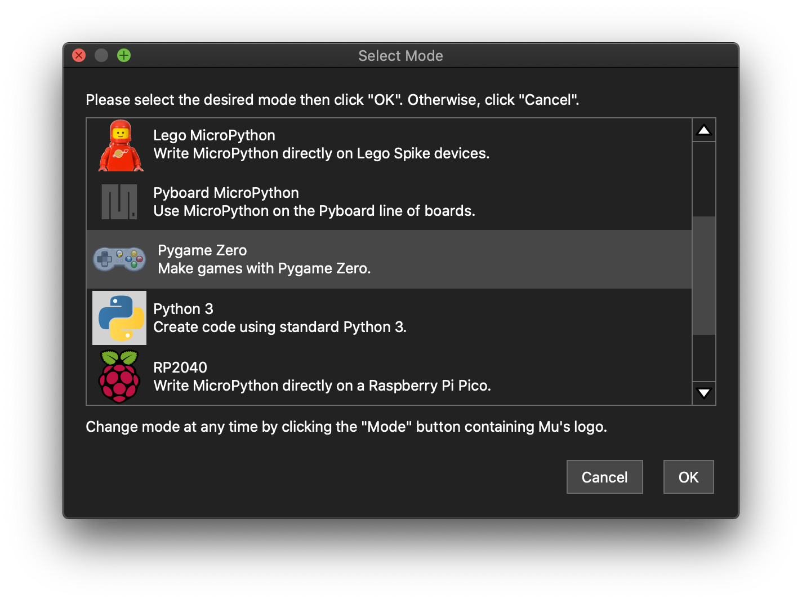

# 2. 개발환경 구축

모든 프로그래밍 언어 배우는 책에서 가장 먼저 등장하는 챕터가 아닐까 한다. 왜냐면 제목에서 유추할 수 있듯이 코딩을 시작하기 위해 사전에 기본적으로 설치될 프로그램들이 존재한다는 의미이고, 이를 설치(Install)하고 설정(Configuration)한 이후에야 본격적인 코딩이 가능하기 때문이다.&#x20;

일반적으로 이 과정에는 크게, 2가지가 필요하다. 첫번째는 사용하고자 하는 프로그래밍 언어(여기서는 파이썬) 그 자체를 설치하는 일이고, 두번째는 이제 그 설치된 언어로 컴퓨터와 소통하기 위해 의미있는 문장과 글을 써내려가는 일(우리는 이 과정을 코딩(또는 프로그래밍)이라 함)을 쉽고 편하게 도와 줄 도우미 프로그램인 코드 편집기(텍스트 에디터: Text Editor) 또는 통합개발환경(IDE: Integrated Development Environment)이라는 프로그램을 설치하는 일이다.&#x20;


**IDE(Integrated Development Environment, 통합개발환경)**: 하나의 프로그램 안에서 소프트웨어 개발과 관련된 모든 기능을 제공하는 환경을 가진 프로그램. 소프트웨어 개발에 관련된 모든 작업이라고 하면 기본적인 코드 편집, 컴파일(Compile), 디버그(Debug), 빌드(Build), 바이너리 배포(Binary deployment), 다른 개발자와의 공동 개발작업 등을 말한다. 유명한 제품으로 마이크로소프트의 비주얼 스튜디오, 구글의 안드로이드 스튜디오, 파이썬 전용 IDE로는 PyCharm 등이 있다.


그런데, 이러한 과정은 새로운 코딩언어를 사용하게 될 때마다 매번 거쳐야 하는 일상적인 일임에도 불구하고, 초보자 입장에서는 여전히 번거롭고 까다로울 수 있는데 예를들어 설치과정 중 문제라도 생겨 해결을 위한 트러블슈팅(trobleshooting)하는 과정 등에서부터 막히면 텍스트코딩은 어렵다는 선입견을 갖을 수 있고, 다행히 저자와 같이 이런 같은 고민을 했던 또다른 해외 개발자/교육자 그룹이 있었으며, 그들은 그러한 목적에 맞게 개발환경의 추가적인 설치가 필요없이 앱을 실행시키지마자 곧바로 코딩을 시작할 수 있는 필요한 모든 것을 이미 다 에디터에 탑재시킨 [Mu 에디터(Mu editor)라는 코드 편집기의 오픈소스 프로젝트](https://github.com/mu-editor/mu)를 시작했으며, **본 서는 순한맛 편으로 코딩 외에 주변적인 일은 최대한 간소화와 생략시키고, 우리가 더 깊히 알고 이해해야 할 텍스트코딩이란 본질에만 더 집중할 수 있게** 하는게 좋을 것이다. 따라서 우리의 취지에 맞게 우리는 Mu 에디터(코드편집기)를 활용해 코딩하도록 하겠다.&#x20;

그럼에도 불구하고, 만약, 별도 개발환경 구축이란 상세를 살펴보기 원하시는 분이 있다면, 본 서의 **매운맛 버전**([오리지널 파이게임 라이브러리를 활용한 파이썬 코딩 배우기 책](dev_env.md))에서 확인해볼 수 있다.

## Mu 에디터(코드편집기)

설치를 위해 [Mu 에디터 공식 사이트](https://codewith.mu/en/download)를 방문해 본인의 컴퓨터 환경에 따라(컴퓨터의 운영체제는 무엇인지에 따라)에 맞는 현 시점의 가장 최신의 설치 프로그램을 다운로드 받아 설치하면 된다.


참고로 **필자는 오픈소스 Mu 에디터를 기존보다 더더욱 교육에 편리하게 활용하기 위해서 소스코드를 수정하여 커스텀 버전을 만들고 있는 중**이다. 예를 들어, 우리가 앞으로 첫 게임으로 만들어 볼 플래피버드 게임제작에 있어서 필요한 리소스(이미지들, 추가설치가 필요한 모듈 등)를 에디터 내에 사전에 탑재시켰다. **이는 최초 에디터 설치 이후에 별도의 리소스의 온라인 추가 설치 등의 번거로움 없이 하나의 에디터만으로도 필요한 교육의 A-Z까지(심지어 오프라인 환경일지라도) 할 수 있게 하기 위한 목적이다.**&#x20;

**그밖에 아이들이 열광(?)할 기능으로 자기가 만든 게임을 친구 등 다른 이에게 쉽게 배포해 즐길 수 있는 기회를 줄 수 있게하기 위한** [**자신의 게임을 단 한 개의 실행 파일(EXE 파일) 형태로 변환해 주는 오리지널 에디터에는 없는 추가기능**](appendix/packaging.md)을 탑재하고 있다.

**해당 커스텀 에디터 버전을 시험해 보고 싶은 분은** [**이 곳**](https://github.com/roboticsware/mu/releases/)**에서 다운로드 할 수 있다.**


<figure><figcaption>
Mu 에디터 공식 사이트
</figcaption></figure>

Mu 에디터는 코딩도우미 프로그램으로서 "단순 코드 편집기" 또는 "통합개발환경(IDE) 프로그램" 둘 중에 어느 쪽에 더 가까울까? 답은 때로는 IDE에 좀 더 가깝고, 때로는 코드 편집기에 더 가깝다고 할 수 있다. Mu 에디터에는 **본인이 코딩하려는 개발환경(이를 모드(mode)라 지칭)**&#xC744; 선택해 손쉽게 바꿀 수 있는 기능을 제공하고 있는데 한 개의 에디터로 다양한 파이썬 코딩(일반 SW개발코딩, 게임코딩, HW제어코딩 등) 을 손쉽게 할 수 있는 초보자 입장에서는 매우 편리한 기능이다. 이러한 모드를 선택하려면 에디터 상단의 메뉴바(Menu bar)에서 **Mode(모드)** 아이콘을 누르면 아래와 같은 (개발환경)모드를 선택해 바꿀 수 있으며(이는 마치 tv리모콘으로 tv채널을 변경하듯이 손쉽게), 현재 우리는 파이게임제로를 활용한 게임코딩을 할 예정이므로, 파이게임제로 모드를 선택해 보자.

<figure><figcaption>
메뉴바의 모드선택 아이콘
</figcaption></figure>

<figure><figcaption>
모드 선택화면
</figcaption></figure>

모드가 잘 선택되었다면, 다음과 같이 현재 선택된 코딩환경이 무엇인지를 보여주는 상태바(Status bar)를 통해 우리가 선택한 코딩모드가 잘 선택되었는지 한번더 확인할 수 있다.

<figure><figcaption></figcaption></figure>

### Mu 에디터 한글화 프로젝트 소개


**위에 에디터 화면은 위에서 언급한 필자가 제작 중인 커스텀 버전의 외관으로, 보이는 것처럼 현재 일부 한글화가 적용되어 있고, 전체 한글화를 목표하고 있다. 다만, 전체 한글화에는 많이 시간이 걸리므로 여러분의 참여를 기다리고 있다. 가능한한 많은 분들이 함께 번역에 참여해 빠른 시간에 마치고, 모두가 함께 그 혜택을 누리길 원하고 있다. 모두를 위해 자신의 시간을 기꺼이 할애해 자발적 참여해 주실 분들을 언제나 환영하고 기다린다🙏**

번역참여링크: [https://crowdin.com/project/mu-editor-korean-translation](https://crowdin.com/project/mu-editor-korean-translation)


이로써 우리는 코딩을 시작하기 위한 사전 준비를 마쳤고, 이제 다음 시간부터는 실제 파이썬 언어 코딩을 시작해 보자.
