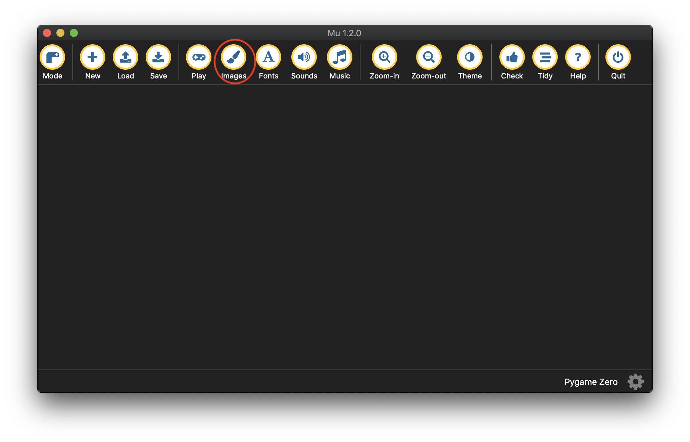

# 5.1 화면에 배경 이미지(오브젝트) 나타내기

엔트리 블록코딩에서의 경험을 상기시켜 보자. 여러분이 게임을 만들 때 가장 먼저 했던 일은 무엇이었을까? 화면에 게임에 등장할 오브젝트를 배치하는 일부터 였을 것 같다. 텍스트코딩에서도 유사하다. 우리도 배경과 주인공(플래피 버드) 등의 오브젝트를 화면에 등장시키는 일부터 시작하길 원한다.&#x20;

엔트리에서도 그랬듯이 게임에 사용할 오브젝트들이 엔트리에 기본 내장된 오브젝트들이 아니라면 별도로 게임에 사용될이미지 파일들을 불러와 엔트리에 등록한 이후에서야 코딩을 시작할 수 있었다. 동일하게 우리가 첫 번째로 해야 할 일은 우리 게임에 사용될 전체 이미지의 압축파일을 여기 [다운로드 링크](https://kinolien.github.io/gitzip/?download=https://github.com/andyborrell/pygamezero_bird/tree/master/images)에서 다운 받아 압축을 푼 후, _Mu 에디터 (이하 뮤 에디터)설치시 자동으로 생성되는 작업 디렉토리 경로(**사용자 계정/mu\_code**)에 디폴트(default) 이미지들의 저장소인 images 라는 폴더(디렉토리) 안으로 일괄 저장시켜 놓는 일이다._ 또는 [커스텀 뮤 에디터](https://github.com/roboticsware/mu/releases)를 사용 중이라면 뮤 에디터의 작업 디렉토리인 (사용자계정)\mu\_code\examples\pygame\_zero\images 안에서 복사해 올 수 있다.

<figure><figcaption></figcaption></figure>

그 폴더의 위치를 확인하고 싶으면,  뮤 에디터상의 메뉴바의 **images 라는 버튼을 눌러** 코딩에 사용되는 이미지들이 저장되는 폴더를 열어보자. 기본적으로 이미 내장된 몇 개의 샘플 이미지가 있을텐데 그 곳에 함께 저장시킬 수 있다.

<figure><figcaption></figcaption></figure>

<figure><figcaption><p>images 폴더에 저장된 게임 이미지들</p></figcaption></figure>



참고로 **게임개발시 필요한 리소스들(이미지, 폰트, 효과음, 배경음)을 담아 놓는 하위폴더들의 이름은 이미 정해진 이름들(images, fonts, sounds, music)로만 생성해야 한다는 파이게임제로 라이브러리가 갖고 있는 기본제약사항이 준수되어야만 하고**, 그러한 이유로, 뮤 에디터에 메뉴 아이콘의 이름들이 그 하위폴더의 이름들과 일치되어 있는 것이다. 따라서, 우리는 리소스의 종류에 맞춰 각각이 아이콘을 눌러 자동으로 열리는 폴더에 해당 리소스 파일을 저장하는 방식으로 개발하는게 편리하기도 하고 실행시 리소스를 발견할 수 없다는 실행에러를 줄일 수 있는 길이다.&#x20;

Mu 에디터의 관련 메뉴얼 참조: [https://codewith.mu/en/howto/1.2/pgzero\_sounds\_images](https://codewith.mu/en/howto/1.2/pgzero_sounds_images)


이제 에디터 창에 아래의 6라인짜리 우리 게임의 첫번째 코드를 입력한 후, 메뉴의 **Play(실행) 아이콘 버튼을 눌러** 실행시켜보자.&#x20;


```python
TITLE = 'Flappy Bird'
WIDTH = 400
HEIGHT = 708

def draw():
    screen.blit('background', (0, 0))
```


게임의 배경화면 이미지가 출력된 우리의 게임앱이 잘 실행되었을 것이다.

<figure><figcaption></figcaption></figure>

:1234: 이제는 코드분석을 해볼 차례이다. 1\~3번 라인의 코드는 이미 지난 과에서 사용해 본 코드이기 때문에 코드 이해의 어려움은 없을 것이다. 5\~6번 라인에서 **draw** 콜백함수 안에서 다시 pygame 라이브러리의 내장함수인 **blit** 함수를 **screen.blit** 형태로 위치정보와 함께 호출하고 있다. **screen.** 이란 blit 함수는 screen 안에 있다는 계층적 위치정보를 가졌기 때문에 기존 서에 배웠던 것처럼 screen 이란 모듈이 있고, 그 안에 있는 blit 함수인가라고 생각할 수 있다. 그러나, 여기서의 screen의 본질은 사실은 모듈이면서 동시에 [이전 서(엔트리 예제로 파이썬 배우기)](https://app.gitbook.com/o/VlyovjzwlgPdLGXwHogx/s/d15BjHzo0klcYpoHnPr6/)에서 언급된 적이 있는 [**객체(오브젝트)**](https://app.gitbook.com/s/d15BjHzo0klcYpoHnPr6/start_coding/1.2-dog-cat#undefined-1)이다. 즉, screen. 이란 뜻는 screen 객체가 갖고 있는(안에 있는) blit이란 함수를 호출하고 있는 것이다.

### 객체(오브젝트)의 이해

객체(오브젝트)를 활용한 텍스트코딩이 이번 책 안에서 처음 등장했기 때문에 다시금 기존 서들에서의 객체에 대한 이해의 수준에서 조금더 심화할 필요가 있겠다. _**객체는 말 그대로 실제 현실 세계(real world)의 어떤 실체가 있는 객체(object), 예를들어 자동차, 동물, 사람 등을 프로그램 세계(program world)에서 사용하게 위한 목적으로 그 특징을 모사한 것일 수도 있고, 어떤 객체는 실 세계에는 없는 오직 프로그램 세계에서만 존재하는 것, 예를들어 몬스터(monster)라는 가상의 객체, 또는 애니메이션(animation)라는 기술적 테크닉 등 일 수 있다.**_&#x20;

_**객체는 그 자체로 하나의 독립된 개체이기 때문에 자신의 속성(attribute)을 표현하기 위한 변수와 자신의 할 수 있는 어떠한 동적인 액션(action) 또는 행동(behavior)을 표현하기 위함 함수(특별히 객체 안에 존재하는 함수를 메소드(method)라 호칭)가 하나로 묶여있게 된다.**_ 예를들어, 자동차를 모사한 객체를 만든다고 했을 때, 자동차가 가질 수 있는 특징으로 차체의 모양, 엔진의 종류, 바퀴의 종류 등의 **속성**을 변수로 갖을 수 있고, 자동차가 할 수 있는 달리거나(drive), 멈추거나(brake), 회전하거나(turn) 등의 **행동**을 함수로 갖을 수 있을 것이다.

위에서 screen이 파이게임제로 라이브러리 저자가 만든 라이브러리 내의 모듈이면서 동시에 객체라고 했고, **라이브러리의 저자들은 항상 자신의 라이브러리 안에 모든 것들을 사용자들이 목적에 맞게 정확하게 사용하도록 별도의 설명서를 제공하는게 일반적이고**, 따라서, [screen 객체에 대한 설명서](https://pygame-zero.readthedocs.io/en/latest/builtins.html#screen)도 저자가 올려놓은 [인터넷 저장소](https://pygame-zero.readthedocs.io/)에서 찾을 수 있다. 설명서에 의하면, screen 객체는 앱의 화면을 객체화한 것으로 그 screen 객체가 할 수 있는 행동(behavior) 중에 하나로 [blit 함수(메소드)](https://pygame-zero.readthedocs.io/en/latest/builtins.html#Screen.blit)를 통해 특정 이미지를 화면의 특정 위치에 그리는 일을 할 수 있는 것이다. 그래서, 결론적으로 우리는 배경이미지를 화면에 그리려는 우리의 목적을 달성하기 위해 screen 객체 안에 blit 함수를 이용하되, blit 함수에서 요구하는 2개의 파라미터 정보는 첫번째로 화면에 무엇을 그려야 하는지 정확히는 그려져야 할 이미지의 파일이름, 두번째로 그 이미지가 화면상에 어디에 그려져야 하는지의 위치정보(정확하게는 이미지의 좌상단(topleft)이 화면상에 어디에 위치해야 하는지의 위치정보)를 요구하고 있다. 그래서, 우리의 함수호출은 최종적으로 이런 형태 screen.blit('background', (0, 0)) 의 모습이 되게 된다.

blit 함수에서 더 알아야 것들이 남아있다. 함수로 넘겨야 하는 실제값(이를 아규먼트(argument) 또는 한국어로 인자값 라는 용어로 지칭) 중에서 함수의 첫번째 인자값은 'background'로 이미지들을 저장해둔 images 폴더 안에 있는 이미지 중에 게임의 배경이미지 파일이름이란 것을 직관적으로 알 수 있으나, 두번째 인자값인 (0, 0)이란 이 위치정보는 이전 서에서 배우지 못한 데이터의 형태(type)를 띠고 있다. (x좌표, y좌표) 형태로 값을 1개가 아닌 복수개인 2개(x, y좌표값)를 한꺼번에 넘기고 있는데, 우리가 이전 서에서 배웠듯이 단 하나의 값이 아니라, 여러 개의 복수의 값을 저장할 수 있는 있는 파이썬에서 제공하는 메모리 공간은 무엇이었는지 기억하는가? 그렇다 [리스트(List)](https://app.gitbook.com/s/nDUP8xZ7pbezrK2wo5dX/basic_syntax/3.6-list)에 담아서 보내면 되겠다라는 생각이 들 것이다. 리스트의 문법형식이 기억나는가? 큰 대괄호 안에 값을 채우면 된다. 즉, 이 경우에 \[x좌표, y좌표] 이렇게 값을 채워서 blit 함수로 전달하면 되지 않겠는가? 그렇다, 가능은 하다. 그런데, 이 함수를 만든 사람은 그렇게 말고, 해당 값들을 소괄호()에 담아 보내달라는 함수 이용자인 우리에게 제약을 걸어두었다. **대괄호에 담는 것과 소괄호에 담는 것에 차이는 무엇인가? 점하나도 공백하나도 다 의미가 있는가 있는 프로그래밍 세계에서 괄호종류가 다른 것은 당연히 의미가 달라진다.** 소괄호에 데이터들를 담는 것은 기존에 우리가 배우지 않았던([이전 서](https://app.gitbook.com/o/VlyovjzwlgPdLGXwHogx/s/d15BjHzo0klcYpoHnPr6/)를 거쳐오지 않은 분들의 경우) 새로운 데이터 유형(타입)이다. 이런 데이터 타입을 튜플(Tuple) 이라고 부른다.

### 튜플 (Tuple)

먼저, 튜플 어떻게 사용할 수 있는 문법을 확인해보자. 정말, 리스트의 대괄호가 소괄호로 바뀐거 외엔 표면적으로 차이가 없다.

> **튜플명 = (문자, 숫자 등의 여러 값. 단, 값들은 콤마(,)로 구분)**

**리스트와 튜플의 근본적인 차이는 값을 추후에 바꿀 수 있느냐/없느냐의 여부이다, 수정가능/읽기전용의 차이이다.** 튜플은 후자인데, 의도적으로 읽기전용(read only)값으로 설정함으로써, 처음 초기값으로 설정한 값을 보호해서 추후에 자신이나 또는 다른 개발자가 개발해나가면서 실수로 해당 값을 변경하려는 시도를 처음부터 막으려는 의도가 있다. 항상 우리는 함수 저작자가 만들어 놓은 의도성 있는 제약을 따르도록 하자. 우리는 남이 만든 함수나 라이브러리를 가져다가 쓰는 입장에서 크게 불만(?)을 갖긴 어렵고, 함수 저작자가 제안하거나 제약하는 틀 안에서 코딩한다고 생각하면 좀 더 편한다. 그래서 간단히 우리는 blit 함수를 쓰려면, 이미지가 그려져야 할 화면상의 x, y좌표값를 튜플에 담아서 함수의 인자값(아규먼트)로 전달한다 라고 생각하면 되고, 그렇게 코딩한 것이다.

## 파이게임제로의 화면좌표계

이제 마지막 의문을 해결하자. 위치정보 데이터의 타입은 튜플이란 것을 알았다. 그런데 왜 위치정보값, 즉, x, y좌표값은 0, 0 이 되어야 하는거지? 라는 의문이 필요하다. 이것을 이해하려면 **파이게임 라이브러리에서의 좌표체계를 알아야 하는데, 이는 우리가 기존에 익숙하던 엔트리/스크래치와는 다른 좌표체계를 갖고 있다. 엔트리/스크래치는 화면중앙이 중심좌표 0, 0 이고, 이것을 기반으로 위치계산하는 좌표체계이다. 그런데, 파이게임의 좌표체계는 아래의 예시처럼 화면의 중앙이 아닌 좌측상단이 0, 0이 된다.** **즉, x의 좌표값은 우측으로 갈수록 커지고, y의 좌표값은 아래방향으로 갈 수록 커지게 된다.**

<figure><figcaption><p>파이게임의 좌표체계 예시 </p></figcaption></figure>

이제 왜 배경 이미지를 화면에 꽉 채위기 위해서는 배경 이미지의 좌상단이 (0, 0) 좌표부터 그려져야 하는지 이해가 되었을 것이다.

이번 장을 마치기 전에 어떤 사람은 아직 해결되지 않은 의문이 남아있을 수 있고, 어떤 사람은 없을 수 있다. 그것은 바로 이것인데 우리는 draw 함수를 정의(definition)만 했지 코드의 어느 곳에서도 그 함수를 호출을 한 적이 없는데 어떻게 누구에 의해 저 함수가 호출이 되서 앱이 실행되어 배경이미지가 잘 그려지고 있지? 라는 것인데, 이전 서에서 [콜백함수](https://app.gitbook.com/s/nDUP8xZ7pbezrK2wo5dX/basic_syntax/3.1-hello-world#undefined-6)의 개념을 제대로 이해하고 있는 사람이었다면 이 의문이 안 남았을 것이고, 만약 의문이 여전히 남아있다면 그것은 콜백함수 개념이 아직 확실히 잡히지 않은 것이니 이전 서로 다시 돌아가 해당파트를 다시한번 공부하고 돌아오도록 하자. 그렇다 **draw 함수는 콜백함수다. 이는 파이게임제로 라이브러리가 사전에 정해놓은 것으로 우리가 화면에 무언가 그려야 할 때는  draw 라는 미리 정해진 이름의 함수를 반드시 사용해야 한다는 것이다. 그래야만 그 함수를 우리 대신에 라이브러리가 직접 자동으로 호출해주기 때문이다.**

다음 장에서는 이어서 우리의 주인공 객체(오브젝트)인 플래피 버드를 화면에 그리고 움직여 보도록 하자.
