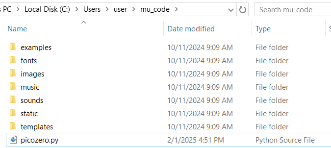

# 5.8 플래피버드 게임 추가기능 구현하기 (플래피버드 애니메이션)

현재 플래피 버드의 이미지는 날고 있는 중임에도 불구하고, 날개짓이 없는 정지상태로 날고 있다. 어딘가 부자연스럽다. 날개짓하는 애니메이션이 표현된다면 더 훌륭한 게임될 수 있겠다. 자, 이제 이 부분을 함께 구현해 보도록 하자. 여러분이 기존에 엔트리 블록코딩에 익숙하다면, 어떻게 해야할지 금새 감이 잡힐 것이다. 엔트리에서는 여러 오브젝트 중에 일부 오브젝트 경우 \[모양]이라는 탭을 누르면, 애니메이션 활용이 가능한 여러 이미지로 구성되어 있음을 알 수 있고, 이 이미지들을 순차적으로 일정시간 간격으로 순환시키면서 애니메이션을 만들었던 기억이 있을 것이다. 만약, 파이게임제로에서도 이런식으로 코딩할 수 있으면 편할 것 같다. 그런데, 오리지널 파이게임제로는 아쉽게도 그런식의 코딩을 할 수 있는 준비가 되어있지 못하다.

### pgzhelper 라이브러리 설치

그러나, **오픈소스 세계의 장점이 무엇인가? 아쉬우면 누구든 오픈된 기존 코드를 수정하므로 기능을 개선해 재공개할 수 있는 것인데**, 싱가폴에 한 개발자가 우리가 엔트리에 코딩에서 해봤던 방식과 유사하게 오브젝트의 애니메이션을 만들 수 있는 [파이게임제로에 기반한 파이썬 추가모듈을 개발해 오픈소스로 제공](https://github.com/QuirkyCort/pgzhelper)하고 있다.&#x20;


pgzhelper 는 스크래치 블록코딩 한 것을 파이게임제로 포팅(porting)하는(똑같이 기능구현하는) 과정에서 파이게임제로 자체 한계로 인해 어려움이 있었던 부분을 개선하기 위해 싱가포르의 **Cort** 라는 개발자가 최초로 만든 것으로, [로보틱스웨어](https://roboticsware.uz)에서도 유사한 이유로 엔트리 블록코딩을 파이게임제로로 포팅을 용이하게 하기위해 이 라이브러리에 추가 기능을 더해 보완하였고, 이를 코드 공개 사이트인 깃허브([https://github.com/roboticsware/pgzhelper](https://github.com/roboticsware/pgzhelper))에서 공개하고 있다.


이번 절에는 그 모듈을 가져다가 활용하도록 하겠다. 현재 [커스텀 뮤 에디터](https://github.com/roboticsware/mu/releases)의 **1.2.6 버전 이상**을 사용해 코딩하고 있다면, 이미 해당 모듈을 에디터 안에 내장하고 있으므로, 위에 언급된 추가적인 모듈설치의 과정없이 곧바로 코딩을 시작할 수 있다!

그러나, 다른 에디터나 IDE를 사용하고 있다면 설치 방법은 크게 두 가지인데 [PIP(Python Package Index)](https://pypi.org/project/pgzhelper-rw/)를 이용한 설치방법과 깃허브 사이트에서 모듈을 메뉴얼로 직접 다운로드 하는 방법이 있다. 먼저, PIP를 이용한 설치방법의 경우는 다음의 명령어를 윈도우즈 사용자의 경우는 명령어 프롬프트창에서 입력하고, 맥 사용자의 경우는 터미널창에서 입력하면 된다.

```
pip install pgzhelper-rw
```

두번째로 직접 다운로드 설치방법을 위해서는 [이곳](https://raw.githubusercontent.com/QuirkyCort/pgzhelper/main/pgzhelper.py)을 누르면, 웹브라우저(필자의 경우, 크롬 웹브라우저)가 열리면서 모듈의 소스코드가 보일 것이고, \[파일] 메뉴에서 \[페이지를 다른 이름으로 저장] 메뉴를 택하고, 저장위치를 우리게임의 소스코드가 존재하는 뮤 에디터의 기본 폴더(본인 계정 아래에 mu\_code라는 폴더)에 저장해 넣도록 하자. 저장하는 방법과 최종 저장된 모습은 아래에서 확인할 수 있다. 우리가 개발 중인 게임 소스코드와 사용하려는 모듈이 같은 위치에 존재하게 하는게 필요한데 그래야만 그 모듈을 단순 import 문을 사용해 코딩할 수 있기 때문이다.

<figure><figcaption></figcaption></figure>

<figure><figcaption></figcaption></figure>

코딩을 위한 준비는 끝났고, 이제 실제 코딩을 시작해 보자.  라이브러리든 모듈이던 만든이의 의도대로 사용자들이 이용하도록 사용자 설명서가 제공되는게 일반적이라고 언급했을 것을 기억한다면, 당연히 이 모듈도 사용법이 안내되어 있고, [이곳](https://www.aposteriori.com.sg/pygame-zero-helper/)에서 확인이 가능하다. 사용법이 주어졌으니 각자 읽어보고 알아서 코딩을 할 수도 있겠으나, 우리 책은 초보자를 배려하는 순한맛 버전이므로 함께 같이 코딩해보도록 하겠다. 먼저 설명서에 언급된 애니메이션 하는 방법만 극도로 간략화시킨 코드는 다음과 같고, 기존 코드를 잠시 임시로 다 주석처리 해놓고, 이렇게 11 라인짜리 코드만을 실행해보면 다음과 같이 애니메이션하는 플래피버드를 확인할 수 있다.


```python
from pgzhelper import *

flappy_bird = Actor('bird1')
flappy_bird.images = ['bird0', 'bird1', 'bird2']
flappy_bird.fps = 10

def update():
  flappy_bird.animate()

def draw():
  flappy_bird.draw()
```


<figure><figcaption></figcaption></figure>

결국 우리는 위에 애니메이션 코드를 우리의 기존에 코드에 적절히 끼워넣으면 되는 것이고, 결론적으로 아래와 같이 최종 코딩을 할 수 있다. 이제 코딩된 내용을 차례차례 함께 이해해 보도록 하자.&#x20;

<pre class="language-python" data-title="flappy_bird.py" data-line-numbers><code class="lang-python"><strong>import random
</strong>from pgzhelper import *
<strong>
</strong><strong>TITLE = 'Flappy Bird'
</strong>WIDTH = 400
HEIGHT = 708

GRAVITY = 0.3
drop_speed = 0
GAP = 140
PIPE_SPEED = -3
bird_alive = True
score = 0

# Actor 객체들
flappy_bird = Actor('bird1', (75, 350))
flappy_bird.images = ['bird0', 'bird1', 'bird2']
flappy_bird.fps = 10
top_pipe = Actor('top', (350,0))
bottom_pipe = Actor('bottom', (350, top_pipe.height + GAP))

def draw():
    screen.blit('background', (0, 0))
    flappy_bird.draw()
    top_pipe.draw()
    bottom_pipe.draw()
    
    screen.draw.text(
        str(score),
        color = 'white',
        midtop = (WIDTH/2, 10),
        fontsize = 70,
        shadow = (1, 1)
    )

def reset_pipes():
    random_y = random.randint(-100, 100)
    top_pipe.y = random_y
    bottom_pipe.y = top_pipe.height + GAP + random_y
    top_pipe.x = WIDTH
    bottom_pipe.x = WIDTH

def update():
    global drop_speed, bird_alive, score
    drop_speed += GRAVITY
    flappy_bird.y += drop_speed
    if bird_alive == True:
        flappy_bird.animate()

    top_pipe.x += PIPE_SPEED
    bottom_pipe.x += PIPE_SPEED
    
    # 파이프의 무한순환
    if top_pipe.right &#x3C; 0 or bottom_pipe.right &#x3C; 0: 
        reset_pipes()
        if bird_alive == True:
            score += 1
        
    # 파이프와의 충돌
    if flappy_bird.colliderect(top_pipe) or flappy_bird.colliderect(bottom_pipe): 
        flappy_bird.image = "birddead"
        bird_alive = False
        
    # 게임의 재시작
    if flappy_bird.y > HEIGHT or flappy_bird.y &#x3C; 0: 
        flappy_bird.image = "bird1"
        bird_alive = True
        flappy_bird.center = (75, 350)
        drop_speed = 0
        reset_pipes()
        score = 0

def on_mouse_down():
    global drop_speed
    if bird_alive == True:
        drop_speed = -6.5
</code></pre>

:1234: 우리는 별도로 가져온 추가모듈(pgzhelper)을 우리 코드 안에서 불러다 쓰기 위해 2번 라인처럼 당연히 먼저 해당 모듈을 import를 해야할 것이다. import 문 사용이 이제 익숙해졌을 것으로 여겨지는데, 여기서는 그 import 문법의 새로운 형태로 from-import \* 문 형태를 처음으로 사용하고 있다. 그냥 **import 하는 것과 from-import \* 하는 둘의 차이는 무엇일까?** 원래 import 문으로 가져온 라이브러리(또는 패키지) 또는 모듈 안에 특정 클래스나 함수를 사용한다고 하면, 우리가 익히 알고 있듯이 해당함수의 계층적 위계의 위치정보를 포함한 (해당함수를 포함하는 상위의)라이브러리(또는 패키지, 모듈)명. 형태로 호출을 해야한다. 예들들어, 37번 라인의 ranint 함수 호출의 예만 봐도 사용을 위해선 **random.** 이란 모듈명이 필요했고, 최종적으로 **random.randint** 형식으로 호출했다. 그러나, 만약 random 모듈을 from-import \* 문을 사용해 from random import \* 으로 import 했다면 사용이 어떻게 달라지는가? 이 경우는 이제 더이상 해당함수의 계층적 위계의 위치정보 없이, 곧바로 함수명인 randint 만으로도 호출이 가능하게 된다. 어떤가? 편리한 면이 있지 않은가? from-import \* 문의 일반적인 목적의 용도는 이렇고, **여기서 pgzhelper 모듈을 from-import \* 문으로 호출해야만 하는 이유는, 앞으로 기술하게 될 Actor 클래서의 추가적인 속성인 images, fps 등과 행동인 animate 함수(메소드)라던지 Actor 클래스 확장을 편리한 코딩으로 사용하기 위한 목적정도로 이해하면 될 것 같다.**

:1234: 그 다음으로 우리는 모듈 사용법 예제에서 요구하는 것처럼  우리가 애니메이션에서 사용할 한장한장(프레임) 이미지의 단계적 이미지들의 **순차적인** 모음을 17번 라인처럼 리스트로 만들어 두어야 한다. 플래피버드가 하늘을 나는 동작은 총 3장의 이미지로 구성되어 있고, 그 이미지들은 우리가 [4.1절](5.1_background.md)에서 images 폴더 안에 이미 복사해 넣어두었다는 것을 기억할 것이다. 그럼, 18번 라인의 fps라는 것은 무엇일까? 간단히 애니메이션이 진행되는 속도라고 생각하자. 구체적으로는 FPS(Frame Per Second)라고 해서, 1초 안에 몇 장의 단계적 이미지(프레임)를 보여줄 것인가에 관한 것인데 자세한 것을 알기 원하는 분은 [이 책의 매운맛 버전](https://app.gitbook.com/s/XqfaxSWS1mduUmYVCPQP/boilerplate#animation)에서 확인하는 것으로 갈음하겠다. 여기서는 단지 fps값이 크면 애니메이션이 빨리지고, 적으면 느려진다라고만 알면 될 것 같고, 몇 차례 실행해보면서 적당값 값을 찾으면 되겠다.

:1234: 이제 남은 것은 update 함수 안에서 animate 함수만 호출하면 끝나지만, 고려할 게 예외상황이 하나 있는데 현재 코드 그대로 놔두면 플래피버드가 날아가다가 파이프에 닿아서 죽은 상태가 되도 플래피버드가 곧바로 다시 부활(?)해 연이어 날아가는 애니메이션을 수행하는 모습을 볼 수 있을 것이다. 당연히 이렇게 되서는 안되기 때문에, 47-48번 라인에서처럼 애니메이션은 플래피버드가 살아있을 때만 가능하다는 조건 안에 애니메이션 실행코드를 가두어 두어야 하겠다.

이로써 플래피버드 게임의 3가지의 추가 기능구현까지 다 마쳤다. 3가지 기능을 추가하면서 총 25라인의 코드가 더 증가해 총 76라인짜리 소스코드가 돼었다. 게임성을 더 높이기 위해  더 추가해 볼 기능들을 얼마든지 더 있다. 예를들어 화면 구석에 현재까지 얻은 가장 높은 점수을 보여줌으로써 게임에 대한 승부욕을 더 높일 수 있고, 파이프의 높낮이만 랜덤(무작위)할게 아니라, 파이프가 달려오는 속도도 게임이 진행됨에 따라 난이도를 높이기 위해 변동성을 줄 수 있을 것이고, 게임의 청각적인 재미를 위해 게임의 사운드(배경음악, 플래피버드가 죽었을 때 효과음, 플래피버드가 공중부양할 때의 효과음 등)를 넣어주는 것도 좋다. 플래피버드 게임은 사실상 몸풀기정도의 첫 프로젝트이니 더 욕심은 내지 않겠다. 위해 언급한 기능들은 추후 다른 게임프로젝트에서 더 다뤄보도록 하겠다. 그러나, 그럼에도 불구하고 지금 당장 스스로 [파이게임제로 라이브러리의 문서](https://pygame-zero.readthedocs.io/)를 참고해 시도해보겠다는 하는 분이 있다면 당연히 그 도전정신에 박수를 보낸다. 그런 도전이 여러분을 더 나은 개발자로 이끄는 것은 자명하기 때문이다.
