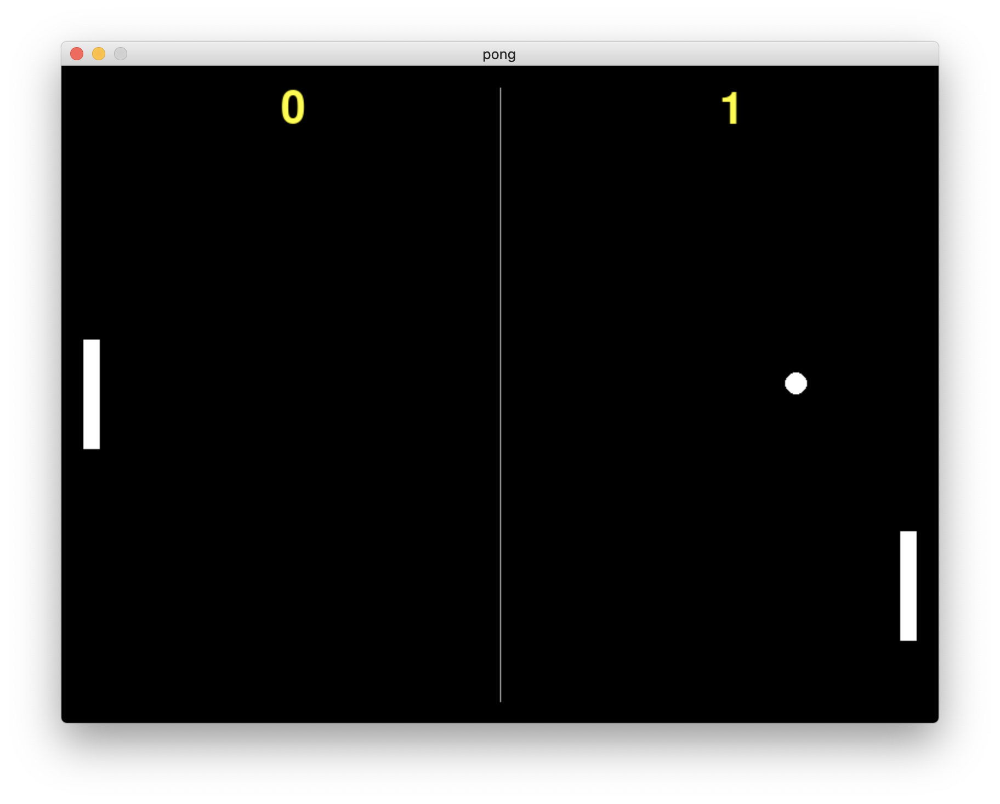

# 8.1 절차지향으로 개발하기 1

바로 아래 화면의 우리가 만들게 될 게임의 최종 결과물을 먼저 보고나면 코드 이해가 훨씬 쉬울 것이다. 우리는 이 게임을 두 가지 프로그래밍 패러다임([절자지향형](https://app.gitbook.com/s/nDUP8xZ7pbezrK2wo5dX/paradigm/4.2-procedural), [객체지향형](https://app.gitbook.com/s/nDUP8xZ7pbezrK2wo5dX/paradigm/4.4-object-oriented)) 각각을 사용한 두 가지 버전으로 만들어 볼 예정이다. 먼저 이전 절에서 예고했듯이 나만의 객체를 만들고 활용하는 것으로 배워 활용해 봄으로써 이제는 보편화되어 사용되는 객체지향형이 기존의 절자지향형과 어떠한 현격한 차이를 가지는지를 이해하고 객체지향 패러다임으로 입문하는 것이 이번 장의 과업이라고 할 수 있겠다.

<figure><figcaption></figcaption></figure>

우리는 이미 5-7장 통해 3개의 게임제작을 소화했기에 이미 튜토리얼 수준을 넘어섰다 볼 수 있다. 따라서, 이번 장부터는 이미 설명한 기본적인 내용에 대한 자세한 중복설명없이 빠르게 핵심적인 코딩에 대한 설명 위주로 진행하는 것이 여러분을 존중(?)하는 것이라 생각한다.

참고로 이번 게임제작에 필요한 사운드 등의 리소스들은 [이곳](https://github.com/roboticsware/python-pygame_zero-samples/tree/main/breakout/images)에서 다운로드 할 수 있으며 게임에 필요한 효과음은 이미 sounds 폴더에 저장되어 있다고 간주하고 시작하겠다. 또는 [커스텀 뮤 에디터](https://github.com/roboticsware/mu/releases)를 사용 중이라면 뮤 에디터의 작업 디렉토리인 (사용자계정)\mu\_code\examples\pygame\_zero 안에서 해당 리소스들을 복사해 올 수 있다.

우선은 먼저 절차지향형으로성의 개발을 시작해 보자. 이 게임은 두 명의 유저가 공을 주고받는 탁구형식의 게임이나 구조적인 면에서는 공과 반사판을 사용한다는 점에서 이전에 만들어 본 [오리지널 블록격파 게임](../breakout/6.5_make_original.md)의 확장판 정도로 여겨질 수 있다. 블록격파에서는 공을 반사시키는 반사판(또는 패들이라 불림)이 1개였으나, 여기서는 사용자별로 별도로 조작하는 2개의 반사판이 존재한다는 차이점 정도를 고려하면 되겠다.


```python
import math
import random

# 게임화면
TITLE = 'pong'
WIDTH = 800
HEIGHT = 600
GAP_FROM_SCR = 20

# 반사판
BAR_H = 100
BAR_W = 15

# 볼
vx = 5
vy = 5
BALL_RADIUS = 10
SPEED_UP = 1.05

# 점수
FINAL_SCORE = 11
b1_score = -1
b2_score = -1

# 배우객체들
ball = Rect(WIDTH/2, HEIGHT/2, \ 
        BALL_RADIUS * math.sqrt(2), BALL_RADIUS * math.sqrt(2))
bar1 = Rect(GAP_FROM_SCR, HEIGHT/2 - BAR_H/2, BAR_W, BAR_H)
bar2 = Rect(WIDTH - BAR_W - GAP_FROM_SCR, HEIGHT/2 - BAR_H/2, BAR_W, BAR_H)
bars = [bar1, bar2]


def reset_ball():
    pass
    
def ball_move_collide():
    pass
    
def gameover_draw():
    pass
    
def bar_move_collide(player):
    pass

def draw():
    screen.clear()
    # 중심선
    screen.draw.line((WIDTH/2, GAP_FROM_SCR), (WIDTH/2, HEIGHT - GAP_FROM_SCR), color='grey')

    # 배우들
    screen.draw.filled_circle(ball.center, BALL_RADIUS, 'white')
    for bar in bars:
        screen.draw.filled_rect(bar, 'white')

    # 점수
    screen.draw.text(str(b1_score), (WIDTH/4, GAP_FROM_SCR), color='yellow', fontsize=60)
    screen.draw.text(str(b2_score), ((WIDTH/4)*3, GAP_FROM_SCR), color='yellow', fontsize=60)
    if b1_score == FINAL_SCORE or b2_score == FINAL_SCORE:
        gameover_draw()

def update():
    global b1_score, b2_score
    
    # 공
    ball_move_collide()

    # 반사판
    for bar in bars:
        bar_move_collide(player)

    # 게임시작 조건
    if (b1_score == FINAL_SCORE or b2_score == FINAL_SCORE) or \
        (b1_score == -1 and b2_score == -1):
        if keyboard.space:
            b1_score = 0
            b2_score = 0
            reset_ball()
    else:  # 공
        ball_move_collide()
```


:1234: 그밖에 6장에서 만들어 본 블록격파 게임과 다른 점은 2인용 게임임에도 불구하고 1인용처럼 실행되자마자 곧바로 시작되면 당황스럽기 때문에, 두 게임유저가 준비되었을 때 스페이스 바를 눌러 플레이를 시작하고, 최종게임승패가 결정난 이후에도 다시 스페이스 바를 눌러 게임을 재시작 할 수 있는 기회가 제공된다. 이와 관련된 코드로는 22-23번 라인에서 점수의 초기값을 -1 로 정한 것으로 게임진행이 아직 시작 전 상태임을 구분하기 위한 목적이고, 스페이스 바를 누르면 72번 이하 라인이 적용되면서 플레이 상태로 들어간다.

:1234: 위의 30번째 라인까지 코드는 게임무대의 배우객체들을 생성하는 것이다. 공(ball),  반사판(bar)와 2개를 생성한다. 각 객체를 만드는 부분은 기존의 오리지널 블록격파 게임과 크게 다르지 않다. 참고로 여기서 배우객체들은 Actor 클래스를 통해 생성한게 아니고, [Rect 클래스](../breakout/6.5_make_original.md#undefined)를 통해 생성된 객체라는 것을 다시한번 유념하자.

현재는 절차지향형으로 개발하기로 했기때문에 필요한 기능들을 함수화(functionalize) 할 필요가 있다는 것을 배웠다. 이번 게임도 함수화를 진행해보자. **코딩에서 항상 염두해 두어야 할 점은 나와 남을 위해 가독성이 좋고, 추후 수정에 대비한 유지보수(maintenance) 측면을 늘 고려해야 한다.** 사실상 함수도 그러한 이유로 출연했다고 할 수 있다. 함수의 주목적은 코드중복을 줄이는 것으로 그러나, 이번 게임에서도 여러 객체가 공통으로 사용할 함수로서 묶을 만한게 많지 않은데, 그나마 동일한 목적과 기능의 반사판 객체가 2개가 등장하고 있어, 이 반사판들이 함께 공유할 수 있는 함수목적에 부합하는 **bar\_move\_collide** 함수를 추가하자. 그밖에 나머지 함수들(**reset\_ball**, **ball\_move\_collide**, **gameover\_draw**)은 공통사용 목적이라기보다 기능적으로 분리된 함수들이라 하겠다.

:1234: 다음 절부터 위에 언급된 함수들의 구현체를 만들어보기로 하고, 지금은 그 함수들을 제외한 나머지 코드들에 대해 더 검토해보자. 지금까지 모든 과정을 함께 공부해 온 여러분의 실력상 대부분은 이전에 이미 배웠던 것들의 약간의 변형이라 찬찬히 드려다보면 대부분 이해가 될 것으로 믿는다.&#x20;

여러분들은 이전에 블록격파 게임을 마무리하면서 제안했던 [추가 도전과제들](../breakout/6.5_make_original.md#undefined-5)에 대해 기억하고 있는가? 그 도전과제들을 스스로 추가 기능구현해 봤는지 모르겠다. 이번 퐁 게임에서는 그 도전과제들에서 제안되었던 추가기능들을 포함해서 구현하도록 하겠다. 따라서, 게임의 흥미를 더하기 위해 두 게임 유저가 빠른 승부를 내지 못하고 계속 랠리(Rally)가 이어지면 점점더 공의 움직임의 속도를 빠르게 하기 위해 18라인에 **SPEED\_UP**의 값만큼 속도를 증가시키는 알고리즘이 추가될 예정이고 그 때 사용하려고 [매크로](https://ko.wikipedia.org/wiki/%EB%A7%A4%ED%81%AC%EB%A1%9C_\(%EC%BB%B4%ED%93%A8%ED%84%B0_%EA%B3%BC%ED%95%99\))(Macro)를 미리 선언해 두었다.

그럼, 이제 다음 절에서부터 본격적으로 우리의 사용자 함수의 구현체를 구체적으로 채워보도록 하겠다.
