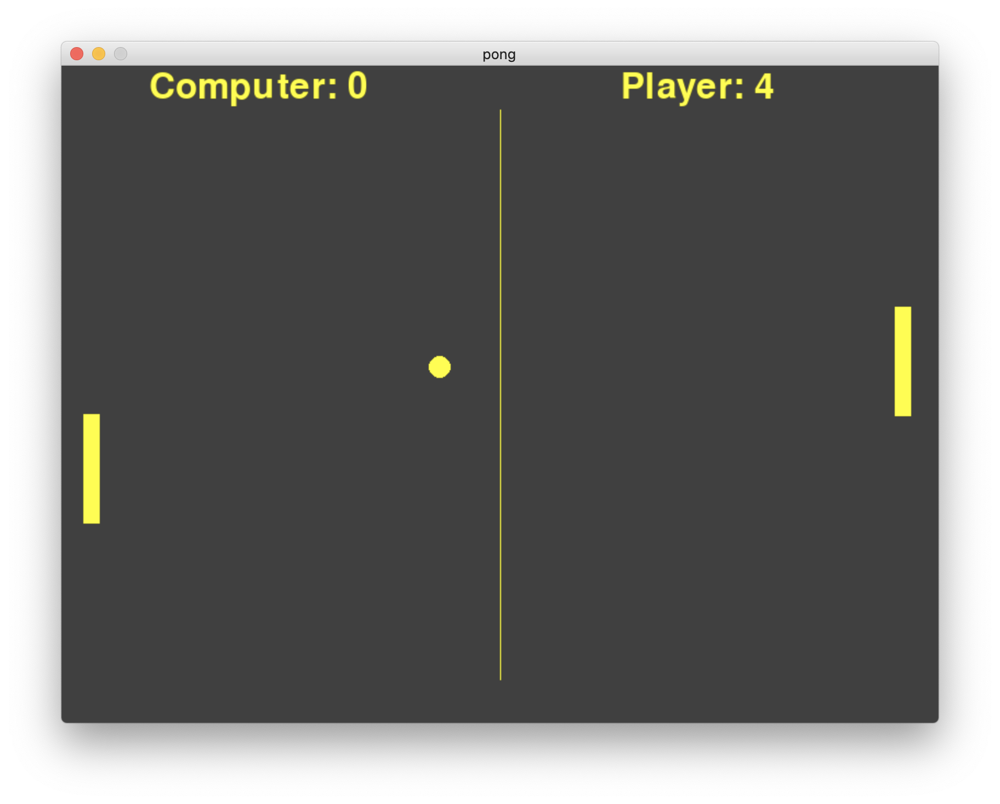

# 8.7 (보너스) 파이게임제로 예제버전 1

### 게임의 디자인 구조 이해하기

이번 보너스 절은 같은 퐁 게임이지만, [파이게임제로 라이브러리의 저자가 직접 만들어 라이브러리의 활용예제로서 함께 배포하는 코드](https://github.com/lordmauve/pgzero/tree/main/examples/pong)를 예제코드로 사용해 함께 코드분석해보며 이런 방식으로도 객체지향 코드를 만들 수 있구나를 공부하는 방식으로 진행해 보겠다. 참고로 해당 예제코드는 이번 과 도입부에서 실제 게임기의 예제 동영상에서 봤던 것처럼 두 명의 유저가 대결방식으로 진행하는 방식의 2인용 게임이 아닌, 컴퓨터가 가상의 상대가 되어 컴퓨터와 대전을 벌이는 1인용 게임을 만들 것이다.

참고로 먼저도 언급된 내용이지만, 일반적으로 파일 한 개로만 모든 소스코드를 만드는 방식은 선호되지는 않으나, 예상하기로는 저자와 같은 의도(최소한 간소화시킨 코드로부터 배우기)로 전체 소스코드를 pong.py 라는 파일 1개로 코딩했다는 것을 기억하자. 뿐만 아니라 게임의 추가적 간소화를 위해 심지어 사운드 효과도 제외하는 등 게임에 어떤 추가적인 미디어을 전혀 사용하지 않고 게임상의 그래픽적 요소들에 대해서도 오직 코드로만 구현했다.

바로 아래 화면의 우리가 만들게 될 게임의 최종 결과물을 먼저 보고나면 코드 이해가 훨씬 쉬울 것이다. 다음으로 실제  코드를  하나씩 살펴보자.

<figure><figcaption></figcaption></figure>

전체적인 윤곽을 빠르게 이해하기 위해 게임의 메인파트(draw, update 함수 등)를 먼저 살펴보도록 하겠다.

```python
# computer-controlled opponent or another player controlling a second
# paddle on the opposing side. Players use the paddles to hit a ball
# back and forth. The aim is for each player to reach eleven points
# before the opponent; points are earned when one fails to return
# the ball to the other.
import pgzrun
import random

WIDTH = 800
HEIGHT = 600
TITLE = 'pong'

# a color used to draw things
MAIN_COLOR = 'yellow'

# width and height of a player paddle
PADDLE_WIDTH = 15
PADDLE_HEIGHT = 100

# radius of the tennis ball
TENNIS_BALL_RADIUS = 10

LEFT_PLAYER = "left"
RIGHT_PLAYER = "right"


player = LEFT_PLAYER # first player is chosen
game = Game(player)


def draw():
    game.draw()


def update():
    if keyboard.up:
        game.right_paddle.up()
    elif keyboard.down:
        game.right_paddle.down()

    # move the computer controlled paddle
    game.computer_act()

    # set the position of the ball to be in the middle of the paddle
    if not game.in_progress:
        game.position_ball()

    if game.in_progress:
        game.proceed()


def on_key_down(key):
    # pressing SPACE launches the ball
    if key == keys.SPACE:
        if game.score_left == 11 or game.score_right == 11:
            game.score_left = game.score_right = 0

        if not game.in_progress and game.active_player == RIGHT_PLAYER:
            game.in_progress = True
```

이 게임 저작자가 만든 코드의 가장 큰 차이점 점은 맨 첫 두 라인은 Game이라는 게임 전체를 총괄하는 슈퍼객체를 두고 있으며, 결국 게임은 이 메인객체 하나로 전체 게임을 구성하고 구성품과 같은 개별 객체(공, 패들(우리는 기존에 반사판이라 칭함))를 관리하는 방식을 취했다. 여러분들은 게임을 만드는 객체지향 코딩을 이런 식으로도 가능하다는 하나의 기법 정도로 이해하면 좋겠다. 그밖에 이 게임의 저자는 점수를 따로 객체로 만들지 않았다는 것이 다르다고 할 수 있다.

게임의 메인파트(draw, update 함수 등)가 게임객체(Game)의 멤버변수/함수의 조작으로만 구성되게 최대한 간략화 시켰기 때문에 크게 코드이해의 어려움은 없다. 좌측 패들은 컴퓨터에 의한 자동조정이고, 우측 패들은 사용자에 의한 조작이다. 여기서 공 객체는 자동으로 중앙선에서 좌우로 뿌려지는 방식이 아닌, 탁구게임과 유사하게 각각의 사용자가 상대를 향해 서브를 넣는 것처럼, 내가 가진 공을 상대를 향해 쏘기(launch) 위해 스페이스 바를 누르는 것이 필요하다. 최종 게임의 승패는 어느 한쪽의 점수가 11점에 도달되었을 경우에 결정되게 된다.

이제 다음 장에서부터 게임객체를 구성하는 3개의 개별 객체(공, 패들, 게임)의 내부를 한개씩 차례대로 살펴보도록 하겠다.
