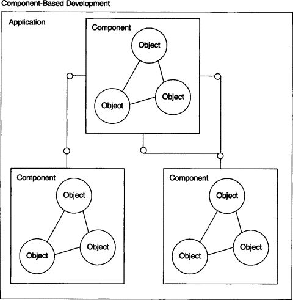

# 8.3 객체지향 개발이론 (객제지향 디자인이란)

이제 우리는 드디어 배틀시티 게임의 [객체지향형](https://app.gitbook.com/s/nDUP8xZ7pbezrK2wo5dX/paradigm/4.4-object-oriented) 버전을 만들기를 도전해 볼 차례이다. 그러나 배틀시티 게임의 객체지향형 버전을 만들어 보기 전에 [절차지향형](https://app.gitbook.com/s/nDUP8xZ7pbezrK2wo5dX/paradigm/4.2-procedural)과 객체지향형 패러다임의 차이를 그림으로 표현한 것을 통해 우리가 최종 목표하는 둘의 근본적 구조적 차이를 먼저 이해해 보도록 하자.&#x20;

<figure><figcaption>
이미지 출처: <a href="https://www.altexsoft.com/blog/pros-and-cons-of-java-programming/">https://www.altexsoft.com/blog/pros-and-cons-of-java-programming/</a>
</figcaption></figure>

<figure><figcaption>
이미지 출처: <a href="https://en.wikipedia.org/wiki/Coupling_(computer_programming)">https://en.wikipedia.org/wiki/Coupling_(computer_programming)</a>
</figcaption></figure>

절차지향형 패러다임은 함수간의 상호 다대다(many-to-many) 관계로 상호간에  강하게 묶여(이를 [겹합도(couping)](https://en.wikipedia.org/wiki/Coupling_\(computer_programming\))가 강하다/높다라고 표현함, 상단의 결합도 관련한 이미지 참조) 서로서로 제안없이 호출하고 의존관계(dependancy)를 맺는 방식의 구조를 갖게 된다. 이게 작은 크기의 프로그램에서는 어느 정도 감당할 수 있지만, 소프트웨어는 한번 만들고 끝인게 아닌 계속적인 진화를 거듭하는 존재로서 시간이 지나 점점더 새로운 기능이 추가되고 기존 기능의 기능개선의 수정과 보완이 이뤄지면서 크기와 양적인 면에서 복잡도(complexity)가 가파르게 증가하여 감당하기 어려운 수준까지 이르게 되기 쉽상이다. 결합도가 높으면 무엇이 문제인가? 기능의 개선이나 기능추가를 하려면 기존 코드수정이 반드시 필요한데, 만약 상호간의 결합도가 높다면, 어느 한부분을 고치면 그게 상당히 많은 다른 코드영역에 영향을 미치게 되고, 그로 인해 다른쪽 코드영역의 재수정이 필요하고, 그 재수정은 또 다른 코드영역에 영향을 미치면서 [나비효과](https://en.wikipedia.org/wiki/Butterfly_effect)처럼 퍼져나가기 때문이다. 높은 복잡도는 이미 잠재적인 소프트웨어의 결함(버그, bug)이 내재되기 쉽고, 코드의 유지보수(maintenance)를 어렵게 만든다. 결국 이처럼 명확한 한계를 갖고 있는게 방법을 계속 고집할 순 없고, 애초부터 이런 한계를 뛰어넘을 수 있는 새로운 패러다임의 프로그래밍 디자인이 필요하게 되었던 것이다.

기존의 함수 상호간의 수많은 직접 참조는 엄청난 복잡성이 생기는 근본 원인이므로 전체 소프트웨어 구성에 있어서 각자의 역할과 책임단위로 각각 독립된 코드 덩어리로 분리할 수 있는 객체라는 개념을 도입해 상대에 대한 직접 호출없이 해당 상대 객체의 역할과 책임이 필요한 시점에 그 수행을 요청하는 방식으로 각각의 독립된 객체 상호간의 협력구조로 전체 프로그램을 실행한다. 이러한 방식은 상호간의 결합도를 매우 낮출 수 있어(상단의 결합도 관련한 이미지 참조) 각각 객체의 코드 수정은 객체 내부에서만 영향을 미칠 뿐이지 자신의 넘어 다른 객체에게까지 미치는 영향은 최소화된다.&#x20;

이러한 객체지향형 패러다임을 더 확장시켜 나아가면, 그 객체들을 모아 하나의 독립된 부품([component](https://en.wikipedia.org/wiki/Software_component)) 형태로 구성할 수 있고,  그 독립된 부품들을 조립해서 하나의 거대한 최종 목적의 소프트웨어 제품을 만드는 방식까지 나아갈 수 있다. 이러한 개발방식을 컴포넌트 기반 개발(CBD([Componenet-Based Development](https://ko.wikipedia.org/wiki/%EC%BB%B4%ED%8F%AC%EB%84%8C%ED%8A%B8_%EA%B8%B0%EB%B0%98_%EC%86%8C%ED%94%84%ED%8A%B8%EC%9B%A8%EC%96%B4_%EA%B3%B5%ED%95%99))) 이라고 불린다. 이 방식의 장점은 잘만들어 놓은 독립된 부품은 다른 소프트웨어 개발에도 해당 부품의 재사용이 가능한 코드 재사용성([reusability](https://en.wikipedia.org/wiki/Reusability))을 높일 수 있단 점이다.&#x20;

<figure><figcaption>
CBD개발에 따른 소프트웨어의 구조( 이미지 출처:  <a href="https://ars.els-cdn.com/content/image/3-s2.0-B978155860900650004X-f01-08-9781558609006.gif">https://ars.els-cdn.com/content/image/3-s2.0-B978155860900650004X-f01-08-9781558609006.gif</a>)
</figcaption></figure>

_객체지향 개발이 위에서 언급된 것처럼 장점만 갖고 있는가? 세상에 어떤 것도 그러한 것은 없을 것 같은데 역시 객체지향도 단점들이 있는데, 무엇보다 코딩을 시작하기에 앞서 각각의 객체자체를 잘 설계(디자인)하는데에 많은 시간과 에너지가 들어간다는 것이다. 설계를 위해 사전에 알아야 할 개념들이 많고, 그러한 개념들을 능숙하게 사용하면서 설계를 잘하는 수준까지 올라가는데도 경험과 시행착오를 통해 상당한 시간과 노력이 소요된다는 점이다._ 그럼에도 불구하고 우리는 수준 높은(?) 개발자가 되기 위해선 피해갈 수 없고 반드시 익혀야 하기에 익숙해지기 전까지 처음에는 다소 어렵게 느껴지더라도 포기하지 말고 인내하며 끝까지 도전할 수 있기를 기대해 본다.

객체지향 설계([OOD: Object-Oriented Design](https://simple.wikipedia.org/wiki/Object-oriented_design))를 시작하기에 앞서, 기존 절차지향과는 다른 사고의 전환이 필요한데 우리가 만들고자 하는 프로그램에 구성과 구조적인 디자인을 할 때, 이제 우리는 객체(오브젝트) 중심으로 사고하는게 필요하다. 그 말은 우리 프로그램에서 객체가 되어야 할 것들을 식별하고, 그들간의 협력구조를 어떻게 만들까를 고민하는 과정이다. 그런데, 다행히도 우리는 엔트리 블록코딩부터 알게 모르게 자연스럽게 그런한 방식의 개발에 이미 익숙해져 있다. 특별히 우리가 만들고 있는 게임프로그램에 있어서 객체들의 식별은 용이한데 게임 무대에 등장하는 등장인물(배우)들 중심으로 객체지향을 구성하면 되기 때문이다. 객체가 식별된 이후에는 각 객체들이 가져야 할 역할(Role)과 책임(Responsibility), 그리고, 각 객체들이 협력을 위해 주고받아야 할 메시지(Message)에 대해서 고민을 시작해야 한다. 참고로 책임은 객체의 외부 곧, 객체의 이용자들에게 제공해 줄 수 있는 서비스의 목록(참고로 객체지향에서는 이를 공용 인터페이스(public interface)이라 지칭)이다.

먼저 기억해야 할 것은 _함수화 과정에서도 마찬가지였는데 코드의 어느 부분을 어디까지 함수화 하느냐에 대한 것에 명확한 답이 있는게 아니듯이 OOD를 할 때도 이렇게 하는게 맞다라는 100% 정답이 없다. 설계를 할 때 이런 기준을 갖고 하는 것을 원칙으로 삼아라 라고 하는 원칙적(예를들어,_ [_SOLID 원칙_](https://ko.wikipedia.org/wiki/SOLID_\(%EA%B0%9D%EC%B2%B4_%EC%A7%80%ED%96%A5_%EC%84%A4%EA%B3%84\))_) 기준제시가 있을 뿐이다._ 사실 설계에 대한 부분을 제대로 공부하고자 한다면, 대학에서서 최소한 한 학기 분량의 내용이라 이 책의 수준에서 그렇게까지 진도가 나가는 것은 너무 과하다. 따라서, 난이도 조절상 모든 설계원칙을 사전에 세세하게 공부하고 이를 일일이 적용하고 설명하기보다 여러분의 이해에 큰 무리가 되지 않는 어느정도 타협하는 선에서객체지향 설계를 적용할 예정이고, 더 심도있는 공부와 함께 그 공부한 내용의 설계를 다양하게 바꿔 적용해 보는 것은 여러분 각자의 몫으로 남겨 놓아야 할 수 밖에 없음을 먼저 양해바란다.

