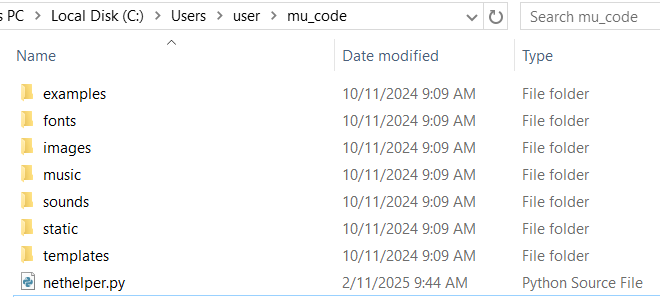

# 10.1 네트워크 게임방식의 이해와 라이브러리 설치

요즘 시대는 항상 인터넷에 연결된(Always-on) 휴대폰의 보편화로 기본적으로 대다수의 게임이 네트워크 상이 다른 유저와 함께 게임을 즐기는 네트워크 게임이 보편화 되었다. 우리 모두는 그러한 게임을 한번 만들어 보고 싶을 것이란 생각이 든다. 그래서, 상용 수준은 아니더라도 그런 게임제작의 원리를 이해하는데 충분한 수준의 게임을 만들어 보기로 하자. 네트워크 게임 제작을 설명하는데 시간이 충분지 않기 때문에 아예 새로운 게임제작 대한 도전으로 시간을 낭비하지 않고, 기존에 우리가 로컬(local)용으로 만들어 봤던 게임을 네트워크 게임으로 전환해 보는 방식으로 진행해 보는게 좋겠다.

네트워크 게임을 만들기 위해서는 기존에 네트워크 게임들이 어떻게 게임유저(user)간의 네트워크 상에 연결을 만들어 관리하는지를 이해할 필요가 있다. 연결을 위한 핵심 솔루션으로는 **게임사용자를 연결하는 호스팅(hosting) 솔루션은 크게 다음 아래의 그림처럼 게임의 요구 사항에 따라 릴레이(Relay) 서버 또는 전용(Dedicated) 게임 서버방식**이 있다. 둘의 구분은 크게 게임참여자의 크기에 따라 구분되는데 2\~10명 내외의 참여자의 동시게임을 위한 것인지와 최소 수십명 이상이 함께 게임하려는 목적인지에 따라 구분할 수 있다. 이 중에서 _우리는 소규모 규모의 무겁지 않은 케주얼 게임에 적합한 릴레이 서버방식의 연결 솔루션을 사용해 게임을 구현하도록 하겠다._

<figure><figcaption>
출처: Unity 웹사이트
</figcaption></figure>

**릴레이 서버는 플레이어 간의 연결과 메시지를 중계하는 역할만 담당하며, 게임 로직은 각 플레이어의 클라이언트에서 처리**하기 때문에 플레이어 간 연결 상태에 따라 게임 성능이 달라질 수 있으며, 불안정한 연결은 지연이나 끊김 현상을 유발할 수 있는 단점은 있으나 장점은 방화벽(firewall)이 있는 네트워크에서도 게임을 진행할 수 있는 장점이 있다.

파이게임제로는 아직 네트워크 게임을 만들 수 있는 라이브러리까진 제공되지 않고 있다. 그러나, 다행히도 pgzhelper의 저작자(Cort)가 또 기여를 했는데, [릴레이 서버에 기반한 네트워크 게임 개발용 라이브러리를 만들어 오픈소스](https://github.com/QuirkyCort/nethelper)로 제공하고 있다.&#x20;

우리는 그 라이브러리 모듈을 가져다가 개발에 활용하도록 하겠다. 현재 [커스텀 뮤 에디터](https://github.com/roboticsware/mu/releases)의 **1.2.9 버전 이상**을 사용해 코딩하고 있다면, 이미 해당 모듈을 에디터 안에 내장하고 있으므로, 위에 언급된 추가적인 모듈설치의 과정없이 곧바로 코딩을 시작할 수 있다!

그러나, 다른 에디터나 IDE를 사용하고 있다면 모듈을 메뉴얼로 다운로드해 설치해야 하는데, 다운로드 하는 방법은 [이곳](https://raw.githubusercontent.com/QuirkyCort/nethelper/refs/heads/main/nethelper.py)을 누르면, 웹브라우저(필자의 경우, 크롬 웹브라우저)가 열리면서 모듈의 소스코드가 보일 것이고, \[파일] 메뉴에서 \[페이지를 다른 이름으로 저장] 메뉴를 택하고, 저장위치를 우리게임의 소스코드가 존재하는 뮤 에디터의 기본 폴더(본인 계정 아래에 mu\_code라는 폴더)에 저장해 넣도록 하자.&#x20;

<figure><figcaption></figcaption></figure>

<figure><figcaption></figcaption></figure>

코딩을 위한 준비는 끝났고, 이제 실제 코딩을 시작해 보자.  라이브러리든 모듈이던 만든이의 의도대로 사용자들이 이용하도록 사용자 설명서가 제공되는게 일반적이라고 언급했던 것을 기억한다면, 당연히 이 모듈도 [깃허브 소스코드 저장소](https://github.com/QuirkyCort/nethelper)에 사용법이 안내되어 있고, [이곳](https://github.com/QuirkyCort/nethelper/wiki)에서는 각 API(Application Programming Interface)의 상세확인이 가능하다. 사용법이 주어졌으니 각자 읽어보고 알아서 코딩을 할 수도 있겠으나, 우리 책은 초보자를 배려하는 순한맛 버전이므로 다음 절에서 같이 코딩을 시작해 보도록 하겠다.
